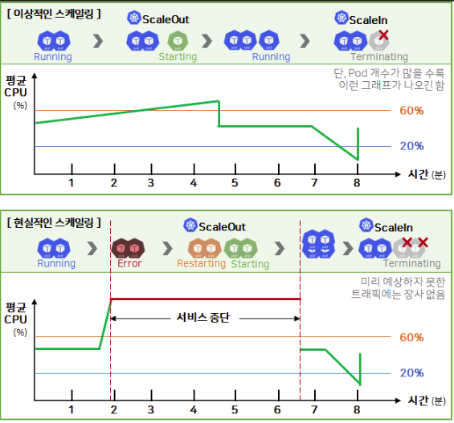

# `HPA` (Horizontal Pod AutoScaler)

- **부하에 따라 Pod 개수를 자동으로 늘리고 줄이는 쿠버네티스 리소스**이다.
- Horizontal은 Pod 하나의 CPU/메모리를 키우는 게 아니라 Pod의 개수를 조절한다는 의미이다.

# 동작 방식

- `HPA`는 컨트롤러 루프로 동작한다.
- 기본 15초마다 대사 워크로드(`Deployment`, `StatefulSet` 등)의 메트릭을 확인하고, 목표치와 비교해 필요한 `replica` 수를 계산한 뒤 대상의 `replicas`값을 수정한다.
    - 실제 `Pod`를 만들거나 지우는 일은 `Deployment` → `ReplicaSet`쪽 컨트롤러가 맡는다.

$$
\text{원하는 Replica 수} = \text{ceil}(\text{현재 replica 수} * \text{현재 메트릭 값} / \text{목표 메트릭 값})
$$

- Ex. Pod 3개의 평균 CPU 사용률이 90%이고 목표가 60%이면 `ceil(3*90/60) = 5`개로 늘어난다.

# HPA 핵심 필드

## 1. `scaleTargetRef` - 스케일할 대상(`Deployment`, `Stateful` 등)을 지정

- `apiVersion` - 버전
- `kind` - 대상 종류
- `name` - 대상 이름

## 2. 개수 범위 조정

- `minReplicas` - Pod 개수의 하한
- `maxReplicas` - Pod 개수의 상한

## 3. `metrics` - 판단 기준(Ex. CPU 60%)

- `type` - 메트릭스 타입
    - `resource.name`
    - `resource.target.type`
    - `resource.target.averageUtilization`

## 4. `behavior` - 스케일 속도 조절

- 잦은 스케일링을 방지한다.
- `scaleUp` - 파드를 늘릴 때
    - `stabilizationWindowSeconds` - 최근 몇초간의 계산 결과를 보고 결정할 지
    - `policies` - 한 번에 얼마나 바꿀 수 있는 지의 상한 목록
    - `selectPolicy` - 정책이 여러 개일 때 어떤 걸 고를지(`Max` , `Min`, `Disabled`)
- `scaleDown` 파드를 줄일 때
    - `scaleUp`과 동일

```yaml
# -------------------------------------------------------------
# 1. 스케일 대상 Deployment
# -------------------------------------------------------------
apiVersion: apps/v1
kind: Deployment
metadata:
  name: web
  namespace: default
spec:
  selector:
    matchLabels:
      app: web
  template:
    metadata:
      labels:
        app: web
    spec:
      containers:
      - name: web
        image: nginx:1.27
        ports:
        - containerPort: 80
        resources:
          requests:           # Utilization 계산의 기준 (없으면 HPA 동작 안 함)
            cpu: 200m
            memory: 256Mi
          limits:
            cpu: 500m
            memory: 512Mi

# -------------------------------------------------------------
# 2. HPA
# -------------------------------------------------------------
apiVersion: autoscaling/v2
kind: HorizontalPodAutoscaler
metadata:
  name: web-hpa
  namespace: default          # 대상과 같은 네임스페이스여야 함
spec:
  # ---------------------------------------------------------
  # [1] 스케일 대상 (/scale 서브리소스를 가진 리소스)
  # ---------------------------------------------------------
  scaleTargetRef:
    apiVersion: apps/v1
    kind: Deployment          # StatefulSet, ReplicaSet, CRD 등도 가능
    name: web
  minReplicas: 2              # 생략 시 1
  maxReplicas: 10             # 필수
  metrics:
  - type: Resource
    resource:
      name: cpu
      target:
        type: Utilization     # requests 대비 %
        averageUtilization: 60
  - type: Resource
    resource:
      name: memory
      target:
        type: AverageValue    # Pod당 평균 절대값
        averageValue: 400Mi
  behavior:
    scaleUp:
      stabilizationWindowSeconds: 0     # 0~3600, 윈도우 내 최솟값 채택
      selectPolicy: Max                 # Max | Min | Disabled
      policies:
      - type: Percent                   # 현재 대비 %
        value: 100
        periodSeconds: 15               # 1~1800
      - type: Pods                      # 절대 개수
        value: 4
        periodSeconds: 15
      # tolerance: 0.05                 # 최신 버전 전용, 기능 게이트 확인 필요
    scaleDown:
      stabilizationWindowSeconds: 300   # 윈도우 내 최댓값 채택
      selectPolicy: Min                 # 가장 보수적인 정책 선택
      policies:
      - type: Percent
        value: 10                       # 1분에 최대 10%
        periodSeconds: 60
      - type: Pods
        value: 1                        # 1분에 최대 1개
        periodSeconds: 60
```

---

## HPA 메트릭 주의사항

### 1. 메모리는 메트릭으로 사용하지 않는다.

- 메모리는 CPU처럼 쓰면 올라가고 안 쓰면 내려가는 자원이 아니다.
- 앱이 최대 사용량을 잡우두고, 한계에 가까워지면 GC가 돌면서 알아서 메모리를 정리한다.
- 즉, **사용 상황에 따라 변화는 값일 뿐 부하에 따라 비례하는 증감 대상이 아니다.**

### 2. CPU만으로는 부족하다.

- 기본 기능으로 쓸 수 있는 건 CPU 뿐인데, 앱마다 **부하 상태**의 기준이 다르다.
    - Ex. 요청량, DB 커넥션 수, 스레드 수 등
- CPU가 오르기 전에 DB 커넥션이 모자라서 Pod를 늘려야 하는 상황 있다.
- 제대로 하려면 **다양한 메트릭을 수집하는 별도 솔루션**이 필요하다.
    - 다만, CPU 기준으로만 충분히 사용할 수 있다면 HPA만 써도 무방하다.

# 이상적인 스케일링과 현실적인 스케일링



- 이상적인 스케일링은 사용량이 완만하게 상승하여 스케일out하는 구조이다.
- 현실에서는 급격한 사용량 폭주로 파드가 전부 죽어 기존 파드는 셀프 힐링으로 재시작하고, 새 파드를 기동한다.
    - 이때 그 시간 만큼 서비스가 중단된다.
- 예상하지 못한 트래픽에는 장사 없다. → 오토스케일링은 보조 수단으로 생각해야한다.
- 확실한 대비책은 **서비스별 피크 시간대를 분석해 미리 자원을 늘려두거나 대기열 아키텍처를 구성**하는 것이다.
    - 파드 수가 많을수록 평균값이 고르게 퍼져서 이상적인 스케일링에 가까워진다. → 유지비용은 증가하지만, 없는 것보단 낫다.